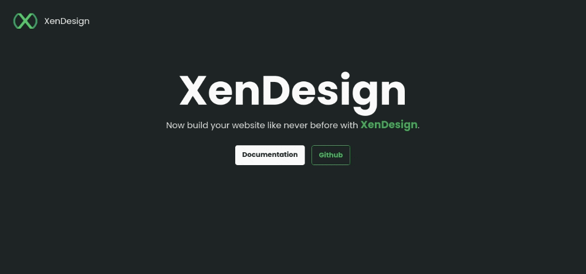

<div align="center">

<br/>
 
<br/>
<br/>
<h1>XenDesign - Component Library</h1>
It's a component library for building UI with ease.
It comes with all the common required components for building a site.


&emsp;

&emsp;

&emsp;

</div>

---

## Live Preview: [XenDesign](https://xendesign.netlify.app)




---

## Quick Start

To start using the components in your project, you will have to import the library either in your HTML or CSS file:

```html
<link rel="stylesheet" href="https://xendesign.netlify.app/index.css" />
```

or

```css
@import url("https://xendesign.netlify.app/index.css");
```

and

```html
<script src="https://xendesign.netlify.app/js/index.js" defer></script>
```

---

### Text Utilities

- [Colors](#colors)
- [Typography](#typography)

---

### Components

- [Alert](#alert)
- [Avatar](#avatar)
- [Badge](#badge)
- [Button](#button)
- [Card](#card)
- [Image](#image)
- [Input](#input)
- [Lists](#lists)
- [Navigation](#navigation)
- [Modal](#modal)
- [Rating](#rating)
- [Toast](#toast)
- [Grid](#grid)
- [Slider](#slider)

---

### Colors

In this component you can see color pallete used

Check it out at: https://xendesign.netlify.app/components/color.html

---

### Typography

XenDesign has the follwing types of typgoraphy:

- Text Size
- Font Weight
- Text Alignment
- Text Descoration and Style

Check it out at: https://xendesign.netlify.app/components/typography.html

---

### Alert

XenDesign provides the following types of Alert:

- Simple Dissmisable Alert
  - Info Alert
  - Success Alert
  - Warning Alert
  - Error Alert

Check it out at: https://xendesign.netlify.app/components/alert.html

---

### Avatar

XenDesign provides the following types of Avatar with different sizes:

- Circle Avatar
- Square Avatar
- Text Avatar

Check it out at: https://xendesign.netlify.app/components/avatar.html

---

### Badge

XenDesign provides the following types of Badge:

- Avatar & Icon Badge
- Status Badge

Check it out at: https://xendesign.netlify.app/components/badge.html

---

### Button

XenDesign provdes the following types of Button:

- Standard Button
- Rounded Button
- Outlined Button
- Link Button
- Floating Action button
- Button with Badge

Check it out at: https://xendesign.netlify.app/components/badge.html

---

### Card

XenDesign provides the following types of Card:

- Standard Card (Vertical)
- Simple Dismissable Card
- Responsive Horizontal Card
- Card with Badge
- Text Overlay Card
- Only Text Card

Check it out at: https://xendesign.netlify.app/components/card.html

---

### Image

XenDesign provides the following types of Image:

- Square Image
- Responsive Image
- Rounded Image

Check it out at: https://xendesign.netlify.app/components/image.html

---

### Input

XenDesign provides the following types of Input:

- Text Input
- Input with validation style
- Input with Icon
- Text Area
- Custom Radio,Checkbox and Switch

Check it out at: https://xendesign.netlify.app/components/input.html

---

### Lists

XenDesign provides the following types of Lists:

- Normal Lists
- Horizontal List
- Stacked / Notification Lists

Check it out at: https://xendesign.netlify.app/components/list.html

---

### Navigation

XenDesign provides the following types of Navigation:

- Simple Navigation Bar (Desktop)
- Fixed Navigation Bar (Desktop)

Check it out at: https://xendesign.netlify.app/components/navigation.html

---

### Modal

XenDesign provides the following types of Modal:

- Simple Modal

Check it out at: https://xendesign.netlify.app/components/modal.html

---

### Rating

XenDesign provides the following types of Rating:

- Dynamic Rating Bar
- Fixed Rating Bar

Check it out at: https://xendesign.netlify.app/components/rating.html

---

### Toast

XenDesign provides the following types of Toast:

- Simple Toast

Check it out at: https://xendesign.netlify.app/components/toast.html

---

### Grid

XenDesign provides the following types of Grid:

- Horizontal Grid system
- Vertical Grid system
- Flexible Grid system
- Utility classes for Grid

Check it out at: https://xendesign.netlify.app/components/grid.html

---

### Slider

XenDesign provides the following types of Slider:

- Custom Standard Slider

Check it out at: https://xendesign.netlify.app/components/slider.html
